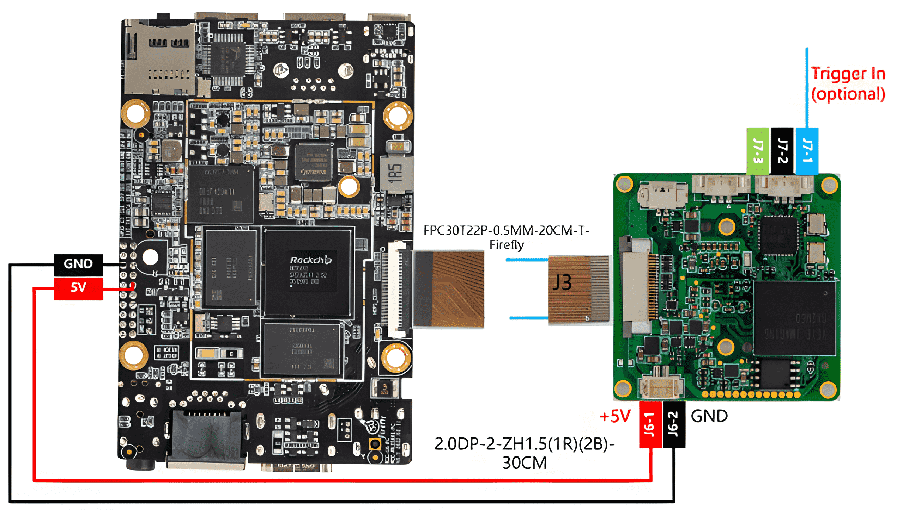

# How to use GX series cameras on Firefly's RK35XX board
This is a mirror of [our wiki article](http://wiki.veye.cc/index.php/GX_Camera_on_Firfly_Boards).

[toc]

## Overview
The GX series cameras are designed for embedded AI applications. They offer high-performance ISP capabilities, support multiple operating modes, provide a wide range of configurable features, and are built with a robust and reliable design. The cameras use the MIPI CSI-2 interface and are well suited for embedded computing platforms.

This article uses the Firefly ROC-RK3588S-PC, ROC-RK3576-PC, and ROC-RK3566-PC boards as examples to describe how to connect GX series cameras to RK3566/RK3568, RK3576, and RK3588S/RK3588-based systems.

Linux drivers are provided for the GX series cameras, with Ubuntu used as the reference operating system.

### Camera Module List

| Series  | Model  | Status  |
| ------------ | ------------ | ------------ |
| GX series	 | GX-MIPI-IMX662	| Done  |
### Supported boards
| Series  | Model  | Status  |
| ------------ | ------------ | ------------ |
| Firefly  | ROC-RK3588S-PC	  | Done  |
| Firefly  | ROC-RK3576-PC  | TBD  |
| Firefly  | ROC-RK3566-PC  | TBD  |
## Hardware Setup
Firefly boards use a 30-pin camera connector, while GX series cameras feature a 22-pin interface and require an independent 5 V power supply. Therefore, a dedicated FFC adapter cable and a separate power cable have been designed to support proper connection and power delivery.
### Connection Diagram

## Introduction to the GitHub Repos
### General part of the Rockchip platform
https://github.com/veyeimaging/rk35xx_veye_bsp

includes:
- driver source code
- i2c toolkits
- application demo

### Firefly Board–Related Resources
https://github.com/veyeimaging/rk35xx_firefly

This repository mainly includes the following contents:

- Device Tree Source (DTS) files and compiled DTB files
- Driver compilation and build instructions
### Board Image Flashing
Precompiled Linux system images are provided in the [GitHub Releases section](https://github.com/veyeimaging/rk35xx_firefly/releases).

### Upgrade Firefly Ubuntu system

For the ROC-RK3566-PC, ROC-RK3576-PC, and ROC-RK3588S-PC boards, we provide release-version system images for flashing.

Please locate the system image corresponding to your specific board that includes support for GX series cameras from the previously mentioned download paths.

Refer to the official Firefly documentation (
[ROC-RK3588S-PC](https://wiki.t-firefly.com/en/ROC-RK3588S-PC/upgrade_bootmode.html) [ROC-RK3566-PC](https://wiki.t-firefly.com/en/ROC-RK3566-PC/03-upgrade_firmware.html)
[ROC-RK3576-PC](https://wiki.t-firefly.com/en/ROC-RK3576-PC/upgrade_bootmode.html)
) for detailed instructions on flashing the system image.

## Check system status
### Camera Detection
After completing the system installation and connecting the camera hardware, power on the system. On the Firefly board, execute the following command to verify whether the camera has been detected correctly:

```
dmesg | grep gxcam
```
There should be similar prompts like the following:

```
[6.667547] gxcam 7-003b: veye gx series camera driver version: 01.00.01
[6.781681] gxcam 7-003b: camera is: GX-MIPI-IMX662
[6.820210] gxcam 7-003b: Success to get gxcam endpoint data lanes, dts uses 2 lanes,will set to camera
[6.834597] gxcam 7-003b: gxcam_enum_controls success
[6.891209] rockchip-csi2-dphy csi2-dphy0: dphy0 matches m00_b_gxcam 7-003b:bus type 5
```
From the log messages above, it can be confirmed that the detected camera model is GX-MIPI-IMX662.

The identifier 7-003b indicates that the camera is connected to I²C bus 7 with an I²C address of 0x3b.
- On the ROC-RK3588S-PC, the camera is connected to i2c-7
- On the ROC-RK3566-PC and ROC-RK3576-PC, the camera is connected to i2c-4

Next, execute the following command to check the video device node:

```
ls /dev/video0
```
If the output shows:

```
video0
```

this indicates that the camera has been successfully registered as /dev/video0.

At this point, both the camera hardware installation and driver setup are complete. For further application development, please refer to the following sections.

## Camera Application Development Guide
[Application Development Guide](https://wiki.veye.cc/index.php/GX_Camera_Application_Development_Guide)

## References
- ROC-RK3566-PC Manual

    https://wiki.t-firefly.com/en/ROC-RK3566-PC/

- ROC-RK3588S-PC Manual

    https://wiki.t-firefly.com/en/ROC-RK3588S-PC/

- ROC-RK3576-PC Manual

    https://wiki.t-firefly.com/en/ROC-RK3576-PC/

- Firefly Linux User Guide

    https://wiki.t-firefly.com/en/Firefly-Linux-Guide/index.html

## Document History
- 2025-12-20

    The document format was adjusted, it was appropriately polished.

- 2025-11-28
    
    The first version.


