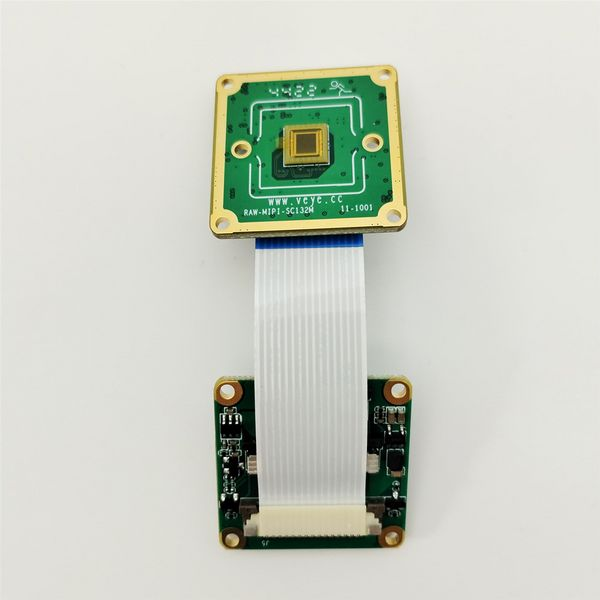

# How to use MV and RAW series cameras on Firefly's RK35XX board
This is a mirror of [our wiki article](http://wiki.veye.cc/index.php/MV_Camera_on_Firfly_Boards).

[toc]

## Overview
The MV series and RAW series cameras are cameras designed for AI applications in the industrial field. They use the MIPI CSI-2 interface and are particularly suitable for use with embedded computing platforms. They have rich data formats and triggering features, extremely low latency, high bandwidth, and reliable stability.

This article takes Firefly's ROC-RK3566-PC,ROC-RK3576-PCand ROC-RK3588S-PC board as an example to introduce how to connect MV and RAW series cameras to the RK3566/3K3568 ,RK3576 and RK3588S/RK3588 system.

We provide drivers for the Linux operating system (using Ubuntu as an example).

### Camera Module List

| Series  | Model  | Status  |
| ------------ | ------------ | ------------ |
| MV Series  | MV-MIPI-IMX178M  | Done  |
| MV Series  | MV-MIPI-IMX130M  | Done  |
| MV Series  | MV-MIPI-IMX296M  | Done  |
| MV Series  | MV-MIPI-IMX287M  | Done  |
| MV Series  | MV-MIPI-IMX265M  | Done  |
| MV Series  | MV-MIPI-IMX264M  | Done  |
| MV Series  | MV-MIPI-GMAX4002M  | Done  |
| RAW Series  | RAW-MIPI-SC132M  | Done  |
| RAW Series  | RAW-MIPI-AR0234M  | Done  |
| RAW Series  | RAW-MIPI-IMX462M  | Done  |
| RAW Series  | RAW-MIPI-SC535M  | Done  |


In addition, the driver for the V-by-One HS connection mode has been finished on the Ubuntu system.

## Hardware Setup

The MV series and RAW series cameras require an ADP-MV2 adapter board to connect to the ROC-RK35xx-PC motherboard.
### Connection of new version ADP-MV2
#### Connection of MV-MIPI-CAM and ADP-MV2
The two are connected using 0.5 mm pitch*30P FFC cable with opposite-side contacts. The cable must be inserted with the silver contacts facing outside.


#### Connection of RAW-MIPI-SC132M and ADP-MV2
The two are connected using 1.0 mm pitch*15P FFC cable with opposite-side contacts. The cable must be inserted with the silver contacts facing outside.



#### Connection of other RAW series camera and ADP-MV2
The two are connected using 0.5 mm pitch*pin FFC cable with opposite-side contacts. The cable must be inserted with the silver contacts facing outside.


#### Connection with Main board using ADP-MV2


### V-by-One-HS-KIT Camera Connection Diagram


## Introduction to github repositories

https://github.com/veyeimaging/rk35xx_veye_bsp
https://github.com/veyeimaging/rk35xx_firefly

includes：
- driver source code
- i2c toolkits
- application demo
In addition, a compiled linux kernel installation package and Android image is provided in the [releases](https://github.com/veyeimaging/rk356x_firefly/releases).

## Upgrade Firefly Ubuntu system

For the ROC-RK3566-PC,ROC-RK3576-PC and ROC-RK3588S-PC, we have provided an image of the release system.

Download the latest Ubuntu imge from https://github.com/veyeimaging/rk35xx_firefly/releases/ .

Refer to the Firefly documentation [ ROC-RK3566-PC](https://wiki.t-firefly.com/en/ROC-RK3566-PC/03-upgrade_firmware.html) [ROC-RK3588S-PC](https://wiki.t-firefly.com/en/ROC-RK3588S-PC/upgrade_bootmode.html) [ROC-RK3576-PC](https://wiki.t-firefly.com/en/ROC-RK3576-PC/upgrade_bootmode.html) to burn in a standard system.

## Check system status
### Whether the camera is correctly recognized
After system update, reboot the main board.

Execute the following command on the main board to check if the camera is properly connected.
```
dmesg | grep mvcam
```
You can see the camera model and the camera version number probed.

A prompt as below indicates that the MV-MIPI-IMX296M camera is detected on the i2c-7 bus.
```
mvcam 7-003b: camera is：MV-MIPI-IMX296M

mvcam 7-003b: firmware version: 0x1290133
```
On the ROC-RK3588S-PC, the camera is mounted on i2c-7, with an i2c address of 0x3b.

On the ROC-RK3566-PC and ROC-RK3576-PC, the camera is mounted on i2c-4.

- Check the video0 device node:
```
ls /dev/video0
```
You should see:
```
video0
```
After successfully identifying the camera, the camera will be recognized as /dev/video0.

## Camera Application Development Guide
[Application Development Guide](https://wiki.veye.cc/index.php/MV_Camera_Application_Development_Guide_on_Rochchip)

## Question Feedback
We are committed to providing richer possibilities for image applications on embedded platforms. Therefore, our software for embedded platforms is based on the principle of open source.

If you have any questions or suggestions about our existing software, please feel free to submit them to the [forum](http://forum.veye.cc/) or email our technical staff at xumm#csoneplus.com.

## References
- ROC-RK3566-PC Manual
https://wiki.t-firefly.com/en/ROC-RK3566-PC/

- ROC-RK3588S-PC Manual
https://wiki.t-firefly.com/en/ROC-RK3588S-PC/

- ROC-RK3576-PC Manual
https://wiki.t-firefly.com/en/ROC-RK3576-PC/

- Firefly Linux User Guide
https://wiki.t-firefly.com/en/Firefly-Linux-Guide/index.html

## Document History
- 2025-12-26
Add a chapter on application development guidelines

- 2025-04-14
Add support for RK3576.

- 2024-07-09
Add support for RAW-MIPI-SC535M.

- 2024-04-17
Support RK3566.

- 2023-07-31
Support V-by-One on ubuntu system.

- 2023-04-12
Release 1st version.
